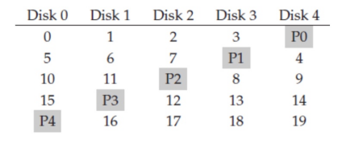

# 操作系统 作业 11

宋婉婷 2022K8009929009

## 11.1

现有一个由 5 块磁盘组成的磁盘阵列，采用 RAID-5 模式，如下图所示。

该磁盘阵列每块盘的磁盘块（block）大小为 4KB，每条（strip）含一个块；磁盘的平均寻道时间是 5ms，平均旋转速度是 12000 RPM（每分钟 12000 转），传输带宽是 200MB/s，请计算：

1）平均来说，从该 RAID5 阵列上读出一个条带（stripe）的时间是多少？

2）当向该 RAID5 阵列中写入连续的两个 4KB 数据块时，平均来说，所需的时间是多少？请考虑这两个数据块属于同一个条带和不同条带的两种情况。

**答：**

(1)rotation time = $\frac{1}{12000\div60}*\frac{1}{2}=2.5ms$​

一个条带分布在不同盘上，且可以并行读取，因此读一个条带的时间就是从磁盘上读一个块的时间，为 $5ms+2.5ms+4KB\div200MB/s=7.5195s$

(2) 如果在同一个条带上，则共享奇偶块，写入时经历步骤：并行读数据块和奇偶块、计算新奇偶校验、并行写数据块和奇偶块，所花时间为 $2*7.5195ms=15.039ms$

如果在不同条带上，则不能并行地读写两个数据块和奇偶块，所花时间为 $4*7.5195ms=30.078ms$

## 11.2

现有一块 320GB 的 SLC SSD，它的擦写上限 (P/E cycles) 是 200,000 次。假设 SSD FTL 能将写均匀分布在所有的闪存页上，若以每秒发 300,000 个写请求的速率写，请问多长时间这块 SSD 会被磨穿?

**答：**

假设页大小为 4KB，每一次写请求擦写一个页。则磨穿所需时间为 $\frac{320*10^9B*200000}{4KB*300000}=602day=1.65year$

## 11.3

现有一块 SSD，每个擦除块有 256 页，且它读一页的延迟是 20 微秒，写一页的延迟是 60 微秒，擦除一块的时间是 1 毫秒。如果该 SSD 的 FTL 采用混合映射，分下面 3 种情况，计算回收一个块需要的时间。

1) Switch merge
2) Partial merge 且假设块中有效页为 50%
3) Full merge

**答：**

1. Switch merge 回收块只需要修改映射表，没有数据拷贝负担，时间为擦除原数据块的 1ms

2. Partial merge 需要将数据块中有效页拷贝到日志块中，再擦除原数据块，用时 $(20+60)*256/2\upmu s+1ms=11.24ms$

3. Full merge 需要将日志块和数据块的有效页拷贝到新块，再擦除原数据块和日志块，用时 $(20+60)*256\upmu s+2ms=22.48ms$

