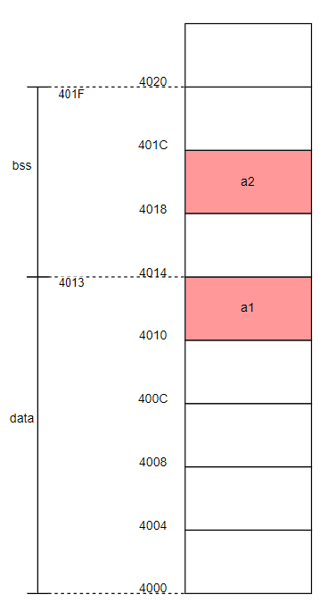

# 操作系统 - 作业 2

宋婉婷 2022K8009929009

## 2.1 堆和栈

### 2.1.1 作业要求

请写一个 C 程序，使其包含 data 段和 bss 段，并在运行时包含堆的使用。请说明所写程序中哪些变量在 data 段、bss 段和堆上，使用 readelf，objdump 查看 data 和 bss 段，并说明该程序是否用到了栈。

### 2.1.2 代码实现

构造 c 程序如下：

```c
#include<stdio.h>
#include<stdlib.h>

int a1 = 10;
int a2;
int main(){
    int b = 3;
    int *c = (int *)malloc(sizeof(int));
    *c = 5;
    int re = a1 + b + *c;
    printf("address of a1 is %p\n",(void*)&a1);
    printf("address of a2 is %p\n",(void*)&a2);
    printf("address of b is %p\n",(void*)&b);
    printf("address of c is %p\n",(void*)c);
    printf("a+b+c=%d\n",re);
    free(c);
    return 0;
}
```

程序包含变量 a1，a2，b，c，re。其中变量 a1 是全局变量，且已被初始化，位于 data 段；变量 a2 是全局变量，但未被初始化，位于 bss 段；变量 b 和 re 是局部变量，位于栈上；变量 c 是动态分配空间的局部变量，其本身位于栈上，指向的内存位于堆上。

### 2.1.3 结果分析

运行结果展示：

```bash
# ./bss
address of a1 is 0x55cf7f153010
address of a2 is 0x55cf7f153018
address of b is 0x7fff0a2ffe78
address of c is 0x55cf997ed2a0
a+b+c=18
```

readelf 结果，部分无关信息省略：

```bash
# readelf -S bss
Section Headers:
  [Nr] Name              Type             Address           Offset
       Size              EntSize          Flags  Link  Info  Align
  ...
  [25] .data             PROGBITS         0000000000004000  00003000
       0000000000000014  0000000000000000  WA       0     0     8
  [26] .bss              NOBITS           0000000000004014  00003014
       000000000000000c  0000000000000000  WA       0     0     4
# readelf -s bss
...
Symbol table '.symtab' contains 41 entries:
   Num:    Value          Size Type    Bind   Vis      Ndx Name
    ...
    26: 0000000000004010     4 OBJECT  GLOBAL DEFAULT   25 a1
    ...
    36: 0000000000004018     4 OBJECT  GLOBAL DEFAULT   26 a2
```

可以画出 data 和 bss 段大致分布示意图如下：



objdump 结果如下，省略打印输出部分：

```assembly
main():
    ...
    11ad:	55                   	push   %rbp          ; 保存旧的基址指针
    11ae:	48 89 e5             	mov    %rsp,%rbp     ; 设置新的基址指针，栈帧建立
    11b1:	48 83 ec 20          	sub    $0x20,%rsp    ; 分配32字节栈空间

    ; 栈保护机制（Stack Canary）
    11b5:	64 48 8b 04 25 28 00 	mov    %fs:0x28,%rax  ; 读取栈保护值
    11bc:	00 00
    11be:	48 89 45 f8          	mov    %rax,-0x8(%rbp) ; 存储到栈上（rbp-0x8）

    ; 初始化局部变量 b = 3
    11c2:	31 c0                	xor    %eax,%eax      ; 清零eax
    11c4:	c7 45 e8 03 00 00 00 	movl   $0x3,-0x18(%rbp) ; b放到栈地址rbp-0x18

    ; 调用 malloc 分配堆内存
    11cb:	bf 04 00 00 00       	mov    $0x4,%edi      ; malloc参数（4字节）
    11d0:	e8 db fe ff ff       	call   10b0 <malloc@plt> ; 调用malloc
    11d5:	48 89 45 f0          	mov    %rax,-0x10(%rbp) ; c放到栈地址rbp-0x10

    ; 写入堆内存 *c = 5
    11d9:	48 8b 45 f0          	mov    -0x10(%rbp),%rax ; 加载堆指针到rax
    11dd:	c7 00 05 00 00 00    	movl   $0x5,(%rax)      ; 写入值5到堆地址

    ; 计算 re = a1 + b + *c
    11e3:	8b 15 27 2e 00 00    	mov    0x2e27(%rip),%edx ; 加载a1的值到edx
    11e9:	8b 45 e8             	mov    -0x18(%rbp),%eax ; 加载b的值到eax
    11ec:	01 c2                	add    %eax,%edx         ; edx=a1+b
    11ee:	48 8b 45 f0          	mov    -0x10(%rbp),%rax ; 加载堆指针到rax
    11f2:	8b 00                	mov    (%rax),%eax       ; 加载堆内存（*c）到eax
    11f4:	01 d0                	add    %edx,%eax         ; eax=(a1+b)+*c
    11f6:	89 45 ec             	mov    %eax,-0x14(%rbp) ; 结果放到栈地址rbp-0x14

    ; 释放堆内存
    1284:	48 8b 45 f0          	mov    -0x10(%rbp),%rax ; 加载堆指针到rax
    1288:	48 89 c7             	mov    %rax,%rdi         ; 准备参数（堆指针）
    128b:	e8 f0 fd ff ff       	call   1080 <free@plt>   ; 调用free
```

可以画出栈空间分配示意图如下：


其中 b 和 re 为 int 整型，采用 4 字节对齐；c 为堆地址指针，采用 8 字节对齐。

## 2.2 进程操作

### 2.2.1 fork&wait

（1）请写一个 C 程序，该程序首先创建一个 1 到 10 的整数数组，然后创建一个子进程，并让子进程对前述数组所有元素求和，并打印求和结果。等子进程完成求和后，父进程打印 “parent process finishes”, 再退出。

使用 fork 创建子进程，在子进程执行完前用 wait 阻塞父进程执行。

```c
#include <stdio.h>
#include <stdlib.h>
#include <unistd.h>
#include <sys/wait.h>

int main() {
    int num[10] = {1,2,3,4,5,6,7,8,9,10};
    pid_t pid = fork();
    if (pid < 0) {
        fprintf(stderr, "Fork failed\n");
        exit(1);
    } else if (pid == 0) {
        int re = 0;
        for(int i=0;i<10;i++){
            re += num[i];
        }
        printf("nums sum result is %d\n",re);
    } else {
        wait(NULL);
        printf("parent process finishes\n");
    }
    return 0;
}
```

结果展示：

```bash
# ./process
nums sum result is 55
parent process finishes
```

### 2.2.2 exec

（2）在（1）所写的程序基础上，当子进程完成数组求和后，让其执行 ls -l 命令 (注：该命令用于显示某个目录下文件和子目录的详细信息)，显示你运行程序所用操作系统的某个目录详情。例如，让子进程执行 ls -l /usr/bin 目录，显示 / usr/bin 目录下的详情。父进程仍然需要等待子进程执行完后打印 “parent process finishes”, 再退出。

在上题程序基础上在子进程中添加 exec 调用，列出当前目录下文件信息。

```c
...
else if (pid == 0) {
        int re = 0;
        for(int i=0;i<10;i++){
            re += num[i];
        }
        printf("nums sum result is %d\n",re);
        execl("/bin/ls", "ls", "-l", NULL);
        perror("execl failed");
        exit(1);
}
```

结果展示：

```bash
# ./process
nums sum result is 55
total 48
-rw-r--r-- 1 root root   409 Oct  2 14:17 hw2_bss.c
-rwxr-xr-x 1 root root 16344 Oct  2 16:14 process
-rw-r--r-- 1 root root   592 Oct  2 16:14 hw2_process.c
parent process finishes
```

### 2.2.3 xv6 源码阅读

（3）请阅读 XV6 代码（https://pdos.csail.mit.edu/6.828/2025/xv6.html），找出 XV6 代码中对进程控制块（PCB）的定义代码，说明其所在的文件，以及当 fork 执行时，对 PCB 做了哪些操作？

PCB 定义代码位于 `kernel/proc.h` 中，展示如下：

```c
// Per-process state
struct proc {
  struct spinlock lock;

  // p->lock must be held when using these:
  enum procstate state;        // Process state
  void *chan;                  // If non-zero, sleeping on chan
  int killed;                  // If non-zero, have been killed
  int xstate;                  // Exit status to be returned to parent's wait
  int pid;                     // Process ID

  // wait_lock must be held when using this:
  struct proc *parent;         // Parent process

  // these are private to the process, so p->lock need not be held.
  uint64 kstack;               // Virtual address of kernel stack
  uint64 sz;                   // Size of process memory (bytes)
  pagetable_t pagetable;       // User page table
  struct trapframe *trapframe; // data page for trampoline.S
  struct context context;      // swtch() here to run process
  struct file *ofile[NOFILE];  // Open files
  struct inode *cwd;           // Current directory
  char name[16];               // Process name (debugging)
};
```

当用户程序使用 `fork()` 时经过以下操作：

1. 首先调用 `allocproc()` 分配一个新的进程，此过程对 PCB 做初始化，修改了 PCB 的 state，pid，kstack，pagetable 和 lock 等等信息。
2. 通过 `uvmcopy(p->pagetable, np->pagetable, p->sz)` 复制父进程的内存空间，修改其 sz 和 pagetable。
3. 复制父进程寄存器状态，修改 trapframe，另外将返回寄存器 a0 置为 0。
4. 复制文件描述符和工作目录，修改 ofile 和 cwd。
5. 设置父子进程关系，复制父进程名称到 name 以便于后续使用。
6. 最后将子进程状态设为 `RUNNABLE`，返回子进程 pid，结束系统调用。

代码附加如下：

```c
// Create a new process, copying the parent.
// Sets up child kernel stack to return as if from fork() system call.
int
kfork(void)
{
  int i, pid;
  struct proc *np;
  struct proc *p = myproc();

  // Allocate process.
  if((np = allocproc()) == 0){
    return -1;
  }

  // Copy user memory from parent to child.
  if(uvmcopy(p->pagetable, np->pagetable, p->sz) < 0){
    freeproc(np);
    release(&np->lock);
    return -1;
  }
  np->sz = p->sz;

  // copy saved user registers.
  *(np->trapframe) = *(p->trapframe);

  // Cause fork to return 0 in the child.
  np->trapframe->a0 = 0;

  // increment reference counts on open file descriptors.
  for(i = 0; i < NOFILE; i++)
    if(p->ofile[i])
      np->ofile[i] = filedup(p->ofile[i]);
  np->cwd = idup(p->cwd);

  safestrcpy(np->name, p->name, sizeof(p->name));

  pid = np->pid;

  release(&np->lock);

  acquire(&wait_lock);
  np->parent = p;
  release(&wait_lock);

  acquire(&np->lock);
  np->state = RUNNABLE;
  release(&np->lock);

  return pid;
}
```

## 2.3 LOOP

源程序：

```c
#include<unistd.h>
#include<stdio.h>
#include<string.h>
#define LOOP 2

int main(int argc,char *argv[]){
    pid_t pid;
    int loop;

    for(loop=0;loop<LOOP;loop++){
        if((pid=fork()) < 0){
            fprintf(stderr, "fork failed\n");
        }
        else if(pid == 0){
            printf("I am child process\n");
        }
        else{
            sleep(5);
        }
    }
    return 0;
}
```

（1）该程序一共会生成几个子进程？请你画出生成的进程之间的关系（即谁是父进程谁是子进程），并对进程关系进行适当说明。

答：该程序一共生成 3 个子进程。`loop = 0` 时，由父进程 main 创建第一个子进程，子进程执行 printf 语句；`loop = 1` 时，由第一个子进程创建第二个子进程，子进程执行 printf 语句；等父进程从 sleep 恢复，创建第三个子进程，执行 printf 语句。

运行结果如下：

```bash
# ./loop
 I am child process
 I am child process
 I am child process
```


（2）如果生成的子进程数量和宏定义 LOOP 不符，在不改变 for 循环的前提下，你能用少量代码修改，使该程序生成 LOOP 个子进程么？

答：可以，只要让子进程在执行完 printf 语句后退出就可以不参与下次 loop，避免创建新的子进程。

改动后代码如下：

```c
#include<unistd.h>
#include<stdio.h>
#include<string.h>
#include<stdlib.h>
#define LOOP 2

int main(int argc,char *argv[]){
    pid_t pid;
    int loop;

    for(loop=0;loop<LOOP;loop++){
        if((pid=fork()) < 0){
            fprintf(stderr, "fork failed\n");
        }
        else if(pid == 0){
            printf("I am child process\n");
            exit(1);
        }
        else{
            sleep(5);
        }
    }
    return 0;
}
```

 运行结果如下：

```bash
# ./loop
 I am child process
 I am child process
```

