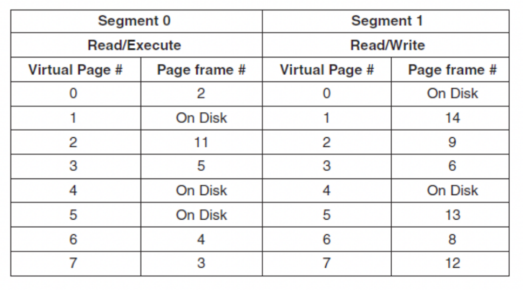

# 操作系统 作业 9

宋婉婷 2022K8009929009

## 9.1

假设一台计算机上运行的一个进程其地址空间有 8 个虚页（每个虚页大小为 4KB，页号为 1 至 8），操作系统给该进程分配了 4 个物理页框（每个页框大小为 4KB），该进程对地址空间中虚页的访问顺序为 1 2 3 5 4 3 7 3 7 8 6 1。假设分配给进程的 4 个物理页框初始为空，请计算：

（1）如果操作系统采用 CLOCK 算法管理内存，那么该进程访存时会发生多少次 page fault？当进程访问完上述虚页后，物理页框中保存的是哪些虚页？

（2）如果操作系统采用 LRU 算法管理内存，请再次回答（1）中的两个问题。请回答虚页保存情况时，写出 LRU 链的组成，标明 LRU 端和 MRU 端。

**答：**

(1)CLOCK 算法

前 4 次访问发生 4 次 page fault，此时状态如下：

| ↓    |      |      |      |
| ---- | ---- | ---- | ---- |
| 1(1) | 2(1) | 3(1) | 5(1) |

访问 4，替换 1，发生 1 次 page fault，此时状态如下：

|      | ↓    |      |      |
| ---- | ---- | ---- | ---- |
| 4(1) | 2(0) | 3(0) | 5(0) |

依次访问 3,7,3,7，其中第二步替换 2，发生 1 次 page fault，状态如下：

|      |      | ↓    |      |
| ---- | ---- | ---- | ---- |
| 4(1) | 7(1) | 3(0) | 5(0) |

访问 8 替换 3，访问 6，替换 5，发生 2 次 page fault，状态如下：

| ↓    |      |      |      |
| ---- | ---- | ---- | ---- |
| 4(1) | 7(1) | 8(1) | 6(1) |

访问 1，指针循环一圈后替换 4，发生 1 次 page fault，最终状态如下：

|      | ↓    |      |      |
| ---- | ---- | ---- | ---- |
| 1(1) | 7(0) | 8(0) | 6(0) |

总共发生 9 次缺页，访问完成后物理页框中保存的是 1,7,8,6

(2)LRU 算法

前 4 次访问发生 4 次 page fault，此时状态如下：

| LRU  | 1    | 2    | 3    | 5    | MRU  |
| ---- | ---- | ---- | ---- | ---- | ---- |

访问 4，替换 1，发生 1 次 page fault，此时状态如下：

| LRU  | 2    | 3    | 5    | 4    | MRU  |
| ---- | ---- | ---- | ---- | ---- | ---- |

访问 3，用 7 替换 2，发生 1 次 page fault，状态如下：

| LRU  | 5    | 4    | 3    | 7    | MRU  |
| ---- | ---- | ---- | ---- | ---- | ---- |

接着再访问一次 3,7，状态不变；访问 8，替换 5，发生 1 次 page fault，状态如下：

| LRU  | 4    | 3    | 7    | 8    | MRU  |
| ---- | ---- | ---- | ---- | ---- | ---- |

访问 6，替换 4，访问 1，替换 3，发生 2 次 page fault，最终状态如下：

| LRU  | 7    | 8    | 6    | 1    | MRU  |
| ---- | ---- | ---- | ---- | ---- | ---- |

总共发生 9 次缺页，LRU 链组成为 7，8，6，1 。

## 9.2

假设一台计算机给每个进程都分配 4 个物理页框，每个页框大小为 1KB。现有一个程序对一个二维整数数组（uint64 X\[32][32]）进行赋值操作，该程序的代码段占用一个固定的页框，并一直存储在内存中。程序使用剩余 3 个物理页框存储数据。该程序操作的数组 X 以列存储形式保存在磁盘上，即 X\[0][0] 后保存的是 X\[1][0]、X\[2][0]…X\[31][0]，然后再保存 X\[0][1]，以此类推。当程序要赋值时，如果所赋值的数组元素不在内存中，则会触发 page fault，操作系统将相应元素以页框粒度交换至内存。如果该进程的物理页框已经用满，则会进行页换出。该程序有如下两种写法。

写法 1：

```
for(int i=0;i<32;i++)

  for(int j=0;j<32;j++)

   X[i][j] = 0
```

写法 2：

```
for(int j=0;j<32;j++)

  for(int i=0;i<32;i++)

   X[i][j] = 0
```

请分析使用这两种写法时，各自会产生多少次 page fault？（注：请写出分析或计算过程）

**答：**

X 每个元素占 8B，一个页框可存放 $1LB\div8B=128$ 个元素 = 32*4

对写法 1：首次执行时 X\[0][0] 发生缺页，第一个页框中写入 X\[0][0]~X\[31][2] 共 128 个元素，使 X\[0][1] 和 X\[0][2] 成功访问，但 X\[0][3] 再次触发缺页，此过程发生 $(32+1)\div3=11$ 次，接着 i+1，进入下一个循环，此后同理。则总共发生 page fault $11*32=352$ 次

对写法 2：首次执行时 X\[0][0] 发生缺页，同上写进第一个页框，使内层循环 i=0 到 i=31 都不缺页，外侧 j=0 到 j=2 都不缺页，直到 j=31 缺页写进下一个页框，此过程发生 $(32+1)\div3=11$ 次，因此总共发生 page fault $11$ 次

## 9.3

假设一个程序有两个段，其中段 0 保存代码指令，段 1 保存读写的数据。段 0 的权限是可读可执行，段 1 的权限是可读可写，如下所示。该程序运行的内存系统提供的虚址空间为 14-bit 空间，其中低 10-bit 为页内偏移，高 4-bit 为页号。

当有如下的访存操作时，请给出每个操作的实际访存物理地址或是产生的异常类型（例如缺页异常、权限异常等）

（1） 读取段 1 中 page 1 的 offset 为 3 的地址

（2） 向段 0 中 page 0 的 offset 为 16 的地址写入

（3） 读取段 1 中 page 4 的 offset 为 28 的地址

（4） 跳转至段 1 中 page 3 的 offset 为 32 的地址



**答：**

(1) 正常访问，物理地址为 11 100 000 000 011，或 0x3903

(2) 权限异常，段 0 不可写

(3) 缺页异常，段 4 在磁盘上

(4) 权限异常，段 1 不可执行

## 9.4

假设一个程序对其地址空间中虚页的访问序列为 0,1,2，…,511,422,0,1,2,…,511，333,0,1,2,…，即访问一串连续地址（页 0 到页 511）后会随机访问一个页（页 422 或页 333），且这个访问模式会一直重复。请分析说明：

（1）假设操作系统分配给该程序的物理页框为 500 个，那么，LRU，Clock 和 FIFO 这三种算法中哪一个会表现较好（即提供较高的命中率），或者这三种算法都表现不佳？为什么？

**答：**

这三种算法都表现不佳，因为给定的页框数足够多，且访问序列重复性很低，没有充分利用到页框。其中 LRU 会稍好于其他两种，因为他考虑了页 422 和 333 的重复读取，但总体上表现仍然不佳。